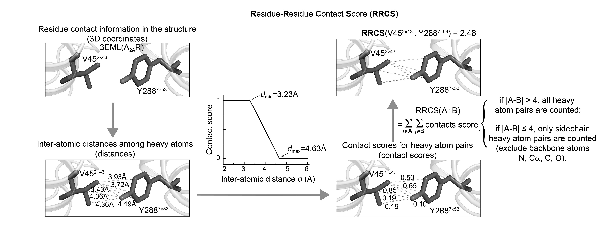
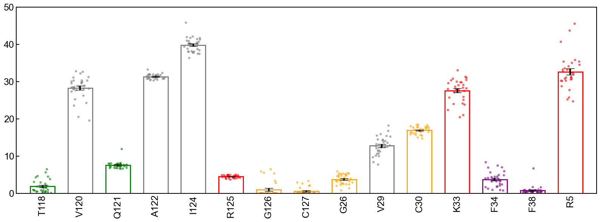
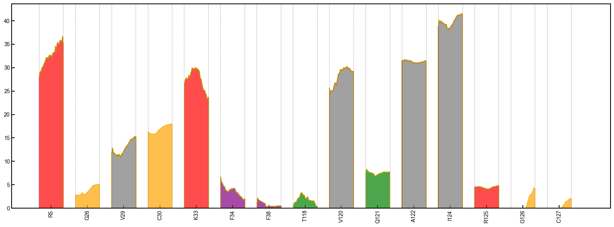

# Tutorial 1: Residue contact analysis of lysozyme MD analysis

## Prepare

This tutorial will use the classic [GROMACs simulation case](http://www.mdtutorials.com/gmx/lysozyme/index.html) to guide users how to use GMX_RRCS to complete step by step contact analysis between residues in the molecular dynamics simulation trajectory.

To make the results more analytical, we adjusted the total duration of the simulation to 300ns.

After the simulation, you will get an xtc file, which contains a series of dynamic structures for the simulation time you specify. The following code can be used to obtain a trace file of xtc type with an interval of 0.1ns, 300ns, and containing only Protein.

```bash
gmx trjconv -f md_0_1.xtc -s md_0_1.tpr -fit rot+trans -center -dt 100 -e 300000 -o md_0_1-dt0.1ns-protein-center.xtc
```


# Calculate RRCS

After determining the successful installation of GMX_RRCS, we first calculate the mutual contact score between residues, the RRCS between residues is defined as:



You can do this in two ways.

## CLI

```
gmx_rrcs --top_file Snapshot-0ns.pdb --traj_file md_300ns-dt0.1ns-protein-center.xtc --res_file residue.txt  --output_file output_rrcs_intraprotein --output_file output_rrcs_intraprotein  --save_hdf5 
```

Because the simulation trajectory is short and the protein residue base is small, we can select all residues for analysis by default. The run should complete in 5 minutes.

You will get a new folder named`output_rrcs_intraprotein`，and the internal structure is as follows：


## Tool function

Tool function calls, just need to run the above code in your notebook or python script

```
import gmx_rrcs as gr
topology = r"Snapshot-0ns.pdb"
trajectory = r"md_300ns-dt0.1ns-protein-center.xtc"
output_dir = "output_rrcs_lysozyme"
selection = "protein"
r_min = 3.23
r_max = 4.63
cutoff = 10.0
dt = 100.0     
bt = 0.0        
et = 300000.0  

gr.compute_intraprotein_rrcs(
topology_file=topology,
trajectory_file=trajectory,
selection=selection,
output_dir=output_dir,
r_min=r_min,
r_max=r_max,
cutoff=cutoff,
dt=dt,
bt=bt,
et=et,
write_xvg=True
)
```

 `output_rrcs_lysozyme` ：

​	`rrcs_results_intraprotein.h5`：Stores RRCS data for all residue pairs on each frame；

​	`xvg` file stores residue-to-RRCs data over time, and users can use other plotting tools such as [Xmgrace](https://plasma-gate.weizmann.ac.il/Grace/) and [gnuplot](http://gnuplot.info) to draw other images as needed.


```
\output_rrcs_lysozyme
	1&39.xvg
	1&40.xvg
	...
	128&129.xvg
	rrcs_results_intraprotein.h5
```


## Plot

### Bar chart + error bar + Scatter chart

Select the residue number that you are interested in, such as the residue number `123W` that we are concerned about, and use the following code to draw the Bar diagram of the residue:

```
pdb_file = r"D:\Round2\Bilis\new\300ns-MDsimulation\Snapshot-0ns.pdb"
h5_file = r"D:\Round2\Bilis\new\300ns-MDsimulation\output_intra_rrcs\rrcs_results_intraprotein.h5"

bt = 0.0   # 0 ns
et = 300000.0  # 300 ns

mean_rrcs_cutoff = 0.8
resid = 123 
out_bar_figure = "Filtered_bar_single_protein.eps"

gr.plot_intraprotein_rrcs_bar_scatter(
pdb_file=pdb_file,
h5_file=h5_file,
bt=bt,
et=et,
mean_rrcs_cutoff=mean_rrcs_cutoff,
resid=resid,
output_figure=out_bar_figure,
y_max=25.0  
)
```

You will find the generated image `Filtered_bar_single_protein.eps` in the current directory.




### Density stack diagram

This method can see the specific dynamic changes over time, there are two modes, when you only focus on a residue, you can use the following code:

```
out_density_figure = "Filtered_density_toge_single_protein.png"

gr.plot_intraprotein_rrcs_stacked_area(
pdb_file=pdb_file,
h5_file=h5_file,
bt=bt,
et=et,
mean_rrcs_cutoff=0.8,
resid=resid,
output_figure=out_density_figure
)
```


